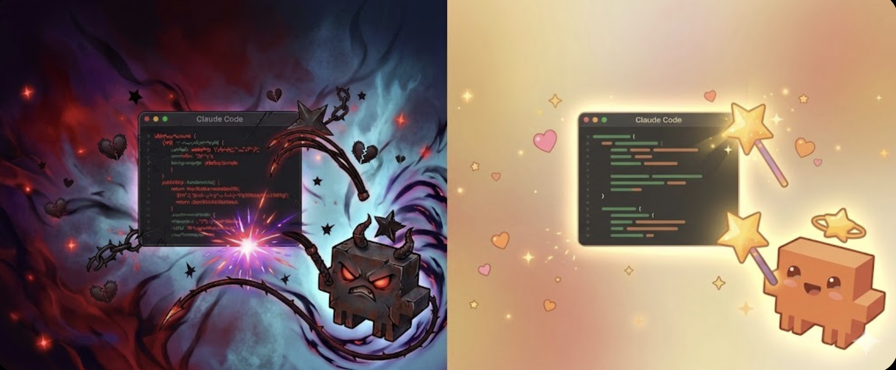

# averageclaude

> A 50/50 gamble for encouragement or discipline for Claude Code! 

Roll the dice to see what vibe Claude gets today. Is it the magical compliment wand? Or the strict red disciplinary whip? 



---

## How to Run

As `averageclaude` is written to run efficiently in the background without a window, you can run it right from the terminal. 

```bash
# Globally install the package on your machine
npm install -g .

# Run the app 
averageclaude
```
*(Alternatively, you can just run `npm start` in this directory!)*

Once running, nothing will appear to happen. This is normal! 

1. Look at your Menu Bar (top right of your screen).
2. Click the `averageclaude` tray icon to spawn the silent overlay.
3. Wave your mouse aggressively back and forth, or click to trigger your 50/50 vibe sequence!

## Debugging

"Nothing types when the wand/whip triggers!"
If you see the visual particle effects and hear the sounds, but no text is actually inserted, macOS is blocking the automated keystrokes for your security. 

The Fix: Go to System Settings > Privacy & Security > Accessibility** and toggle exactly the terminal app you are running this from (e.g. `Terminal`, `iTerm`, `Cursor`) to ON.

"Terminal says `electron: command not found`!"
Your node environment interrupted the electron binary download during install. 
The Fix: Run a clean install: `rm -rf node_modules package-lock.json && npm install && npm start`.

## Customization

* The Strings: Open `main.js` and edit the `messages` object to change exactly what compliments or disciplines get typed into the terminal.
* The Physics: Open `overlay.html` and edit the `P` object to change wand length, whip constraint gravity, tracking speeds, wave thresholds, and more!

## Controls

- Click tray icon: summon your magic wand OR spawn whip
- Wave it around: a golden wand with a twinkling star follows your cursor, shedding sparkles OR drops whip
- Wave fast enough: sends Claude a blessing with words of encouragement OR it gets cooked